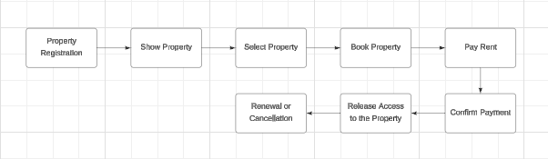

Plataforma de Aluguel Descentralizada

Este projeto visa criar uma plataforma de aluguel descentralizada, utilizando blockchain para garantir transparência e segurança nas transações. A plataforma permite que locadores cadastrem suas propriedades e locatários as reservem e paguem em criptomoedas.
Requisitos Funcionais
Cadastro de Propriedades
Descrição: O locador deve poder cadastrar suas propriedades disponíveis para aluguel, fornecendo detalhes como endereço, tipo e valor do aluguel.
Funcionalidades:
Inserir Detalhes da Propriedade: Incluir informações detalhadas sobre a propriedade.
Visualizar Propriedades Cadastradas: Listar todas as propriedades disponíveis para aluguel.
Reserva de Propriedade
Descrição: O locatário deve poder selecionar e reservar uma propriedade disponível.
Funcionalidades:
Selecionar Propriedade Desejada: Escolher a propriedade que deseja alugar.
Confirmar Reserva: Confirmar a reserva da propriedade.
Pagamento do Aluguel
Descrição: O locatário deve poder pagar o aluguel em criptomoedas através da plataforma.
Funcionalidades:
Realizar Pagamento: Efetuar o pagamento do aluguel usando criptomoedas.
Confirmar Recebimento do Pagamento: Confirmar que o pagamento foi recebido.
Controle de Acesso
Descrição: Após o pagamento, o locatário deve ter acesso à propriedade.
Funcionalidades:
Liberar Acesso à Propriedade: Liberar o acesso após confirmação do pagamento.
Notificar Locador: Notificar o locador sobre o acesso liberado.
Renovação e Cancelamento do Contrato
Descrição: O locatário deve poder renovar ou cancelar o contrato de aluguel.
Funcionalidades:
Renovar Contrato Automaticamente: Renovar o contrato se não for cancelado.
Cancelar Contrato: Cancelar o contrato com antecedência.
Requisitos Não Funcionais
Segurança
Descrição: O sistema deve garantir a segurança dos dados e transações.
Funcionalidades:
Utilizar Blockchain: Garantir transparência e imutabilidade das transações.
Autenticação e Autorização: Implementar autenticação e autorização para acessar funcionalidades.
Escalabilidade
Descrição: O sistema deve ser capaz de lidar com um grande número de usuários e transações.
Funcionalidades:
Tecnologias Escaláveis: Utilizar tecnologias escaláveis para o backend e frontend.
Mecanismos de Cache e Otimização: Implementar mecanismos de cache e otimização de desempenho.
Usabilidade
Descrição: O sistema deve ser fácil de usar para locadores e locatários.
Funcionalidades:
Interface de Usuário Intuitiva: Desenvolver uma interface de usuário clara e fácil de usar.
Documentação Clara: Fornecer documentação clara para novos usuários.
